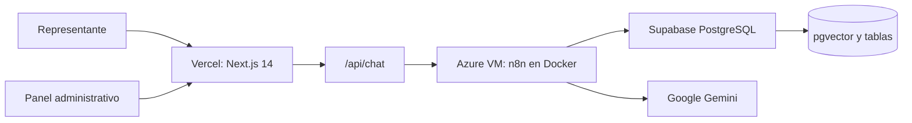

# Arquitectura del sistema

## Vista general

El proyecto utiliza una arquitectura modular orientada a servicios. El
frontend no se conecta directamente con n8n ni con las claves privadas: la
ruta de servidor `/api/chat` funciona como proxy y límite de seguridad.



## Componentes

### 1. Presentación: Next.js

El frontend está en [`frontend/`](../frontend/). La página principal implementa
el chat, las tarjetas de horarios y el modal de confirmación de citas.

La ruta [`frontend/src/app/api/chat/route.ts`](../frontend/src/app/api/chat/route.ts)
realiza estas tareas:

1. Recibe mensajes y solicitudes de agendamiento.
2. Reenvía el payload al webhook privado de n8n.
3. Normaliza respuestas con `respuesta`, `pensamiento` y
   `horarios_disponibles`.
4. Filtra cuándo deben mostrarse horarios de citas.
5. Devuelve errores HTTP explícitos al cliente.

El panel administrativo se encuentra en
[`frontend/src/app/admin/`](../frontend/src/app/admin/) y usa autenticación de
Supabase.

### 2. Orquestación: n8n

El workflow de [`n8n/workflow_colegio.json`](../n8n/workflow_colegio.json)
expone el webhook `POST /webhook/chat` y separa dos caminos:

```text
Webhook
  ├── accion = agendar
  │     └── RPC agendar_cita en Supabase
  └── consulta informativa
        ├── Embedding de la pregunta con Gemini
        ├── RPC match_documentos en Supabase
        ├── Consulta de horarios disponibles
        ├── Construcción del contexto
        └── Respuesta final con Gemini
```

n8n se ejecuta localmente con
[`n8n/docker-compose.yml`](../n8n/docker-compose.yml) o en una Azure VM para
producción. El volumen `n8n_datos` conserva workflows y credenciales.

### 3. Datos: Supabase y PostgreSQL

Los scripts SQL de [`database/`](../database/) crean:

- `documentos_normativos`: base de conocimiento y embeddings de 768 dimensiones.
- `calendario_directivo`: bloques disponibles u ocupados.
- `citas_agendadas`: citas confirmadas con restricción única por horario.
- Políticas RLS para separar lectura pública y operaciones administrativas.
- `match_documentos`: búsqueda por similitud coseno.
- `agendar_cita`: reserva condicional atómica.

La reserva cambia el horario de `Disponible` a `Ocupado` en una sola operación.
Si otra petición ya lo tomó, la función devuelve una respuesta de negocio sin
crear una segunda cita.

## Flujo de una consulta RAG

1. El usuario escribe una pregunta en el frontend.
2. Next.js la envía a `/api/chat`.
3. n8n genera un embedding con Gemini.
4. Supabase busca documentos similares mediante `match_documentos`.
5. n8n combina la pregunta, los documentos recuperados y los horarios.
6. Gemini genera una respuesta con temperatura cero.
7. n8n devuelve la respuesta a Next.js.
8. Next.js presenta el texto, el razonamiento separado y, si corresponde, las
   tarjetas de horarios.

## Flujo de agendamiento

1. El usuario selecciona un horario y completa el formulario.
2. El frontend envía `accion: "agendar"` a `/api/chat`.
3. n8n llama a `agendar_cita` en Supabase.
4. PostgreSQL verifica y actualiza el horario de forma atómica.
5. Si la reserva es válida, se crea `citas_agendadas`.
6. La confirmación se muestra en el chat.

## Despliegue

```text
Vercel
  └── Next.js + API Routes
        └── HTTPS: N8N_WEBHOOK_URL
              └── Azure VM
                    └── Docker Compose: n8n + proxy HTTPS
                          ├── Supabase PostgreSQL/pgvector
                          └── Google Gemini API
```

Los pasos operativos están en [`SETUP.md`](./SETUP.md).

Los controles de calidad y pruebas están en
[`CALIDAD.md`](./CALIDAD.md).
